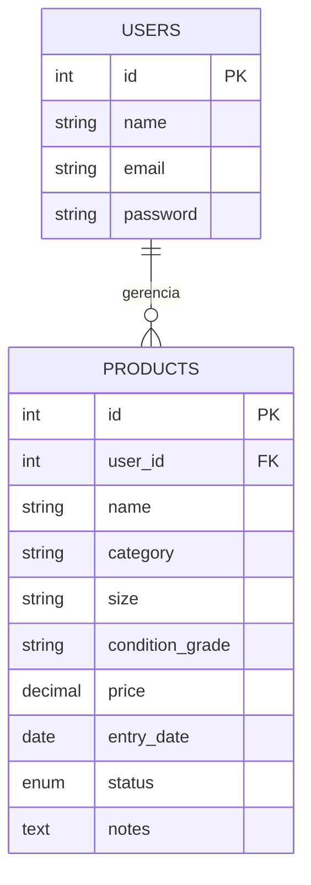

# Garimpo Brechó

Sistema web de gerenciamento de estoque de brechó desenvolvido para o trabalho T2 com PHP puro, MySQL, HTML5, CSS3, JavaScript e Bootstrap 5.

## Funcionalidades
- Cadastro, login, logout e recuperação de senha por token com expiração.
- Dashboard com indicadores do acervo e peças recentes.
- CRUD completo de peças, com filtros por status e categoria.
- Importação de estoque por CSV com modelo para download e validação transacional.
- Catálogo com 9 categorias iconizadas e código automático inspirado na classificação Dewey (`101.001` para camisas, `102.001` para calças, `201.001` para tênis etc.).
- Campo único de origem da peça e contatos recorrentes que podem fornecer, comprar ou fazer os dois.
- Relatório exportável em CSV com filtros de status e categoria.
- Sessões, CSRF, prepared statements, validação no cliente/servidor, escape contra XSS e `password_hash`.

## Instalação
1. Instale PHP 8.1+, MySQL 8+ e a extensão `pdo_mysql` (`sudo apt install php8.5-mysql`).
2. Crie o banco e o usuário da aplicação. Em instalações Ubuntu com MySQL via Snap, use:
    `sudo mysql -u root -e "CREATE DATABASE IF NOT EXISTS agenda_viva CHARACTER SET utf8mb4 COLLATE utf8mb4_unicode_ci; CREATE USER IF NOT EXISTS 'agenda_app'@'localhost' IDENTIFIED BY 'agenda_app_dev'; CREATE USER IF NOT EXISTS 'agenda_app'@'127.0.0.1' IDENTIFIED BY 'agenda_app_dev'; GRANT ALL PRIVILEGES ON agenda_viva.* TO 'agenda_app'@'localhost'; GRANT ALL PRIVILEGES ON agenda_viva.* TO 'agenda_app'@'127.0.0.1'; FLUSH PRIVILEGES;"`
3. Importe as tabelas: `cat database.sql | mysql -u agenda_app -p agenda_viva`, usando a senha definida no seu ambiente. O pipe é recomendado para clientes MySQL instalados via Snap.
4. As credenciais padrão ficam em `config/config.php`; elas também podem ser substituídas por `DB_HOST`, `DB_NAME`, `DB_USER` e `DB_PASS`.
5. Na pasta do projeto, execute `php -S localhost:8000`.
6. Acesse `http://localhost:8000`.

## Publicar pelo GitHub
O GitHub armazena o código, mas o GitHub Pages não executa PHP nem MySQL. Para colocar o sistema online, crie um repositório contendo somente esta pasta e conecte-o a um serviço com suporte a Docker, como Render.

No Render, escolha **New Web Service**, conecte o repositório e deixe o ambiente Docker ser detectado pelo `Dockerfile`. Cadastre as variáveis `DB_HOST`, `DB_PORT`, `DB_NAME`, `DB_USER` e `DB_PASS` usando os dados de um MySQL hospedado. Depois importe o `database.sql` nesse banco. O arquivo `render.yaml` já declara as variáveis necessárias. Se a aplicação estiver hospedada no Railway, ela reconhece `MYSQLHOST`, `MYSQLPORT`, `MYSQLDATABASE`, `MYSQLUSER`, `MYSQLPASSWORD` e `MYSQL_URL`.

Não publique `config/local.php`, `.env` ou senhas no GitHub. O arquivo `.env.example` contém somente os nomes das variáveis esperadas.

### Variáveis no serviço web do Railway
No serviço PHP, abra **Variables** e crie referências para o serviço MySQL. Se o serviço do banco se chama `MySQL`, use:
```text
DB_HOST=${{MySQL.MYSQLHOST}}
DB_PORT=${{MySQL.MYSQLPORT}}
DB_NAME=${{MySQL.MYSQLDATABASE}}
DB_USER=${{MySQL.MYSQLUSER}}
DB_PASS=${{MySQL.MYSQLPASSWORD}}
```
Troque `MySQL` pelo nome exato do serviço do seu banco. Salve e faça **Redeploy**. Não use `localhost` como `DB_HOST` no serviço web: o banco está em outro container.

### Banco no Railway
No editor SQL do Railway, execute uma consulta por vez, nesta ordem:
1. `railway-01-users.sql`
2. `railway-02-contacts.sql`
3. `railway-03-products.sql`

Esses arquivos não contêm `CREATE DATABASE` nem `USE`, pois o Railway já seleciona o banco automaticamente. Execute cada arquivo separadamente, incluindo o `;` final. Não cole prompts do terminal, como `bash-5.1#`, junto com o SQL. `railway.sql` contém a versão completa para clientes que aceitam múltiplas consultas.

Se houver duas instâncias Snap (`mysql` e `mysql-strict`) usando as portas 3306/3307, mantenha apenas uma ativa para evitar conflito: `sudo snap stop mysql-strict`.

## Modelagem


## Decisões técnicas
A aplicação usa uma organização MVC simplificada: `config/` concentra infraestrutura, `includes/` regras compartilhadas, `partials/` apresentação reutilizável e as páginas PHP controlam cada caso de uso. O acesso a dados é feito exclusivamente por PDO com emulação de prepared statements desativada. Cada consulta de clientes filtra pelo `user_id`, garantindo que uma conta não veja dados de outra.

A recuperação de senha demonstra o fluxo em ambiente local exibindo o token na própria tela; em produção, esse token deve ser enviado por um serviço de e-mail e nunca exibido na resposta.

## Estrutura
- `database.sql`: criação do banco, tabelas, chaves e índices.
- `config/`: conexão e configurações.
- `includes/`: autenticação, sessão, CSRF e helpers.
- `assets/`: CSS e JavaScript.
- `login.php`, `register.php`, `forgot.php`, `reset.php`: autenticação.
- `dashboard.php`, `clients.php`, `report.php`: painel, estoque e relatórios.
- `migration_brecho.sql`: migração da tabela antiga para o estoque de peças.
- `contacts.php`: cadastro de fornecedores e compradores recorrentes.
